# Data Processing Tool for Band Diagram (PyQt GUI)

The program is developed by [Hao Song](https://sites.google.com/site/samsongzju1994/) along with Department of Physics, Concordia University. The work is cooperated with Kathleen McGarvey-Lechable(<kmlechable@gmail.com>) and Pablo Bianucci(<pablo.bianucci@concordia.ca>).
##Introduction

### Smoothness Filter
This tool is to transform the band diagram in First Brillouin Zone to Extended Zone in order to design the Photonic Crystal Devices. In short, it is a filter to take out data from a two-dimensional list. 

Getting the raw data from [MPB(MIT Photonic-Bands)](http://ab-initio.mit.edu/wiki/index.php/MIT_Photonic_Bands) simulation, sometimes we could not directly get the knowledge where the Bandedge is as the Bands are overlapped and mixed. Even though looking at the field image would provide a more direct idea and help figure out the band diagram, the efficiency and validity of such process may be low as in some specific cases it is not easy to tell one band from the other band by reading the image. 

To solve these problems, the basic idea is to measure the gradient of the present dispersion line to match the next data point (Here we call such filter as Smoothness Fiter). To state differently, it is to achieve the minimum of the second-order derivatives, or more precisely second-order differences.

```Python
d0 = Band1[i - 1] - Band1[i - 2]
d2 = float(lines[(i + 17) % period][k]) - Band1[i - 1]
if(abs(d2 - d0) < abs(dmin - d0)):
	Band1[i] = float(lines[(i + 17) % period][k])
	dmin = d2
```

### Field Image Filter
As the field image provide a direct knowledge of the band order, it is wise to develop a image filter. Processing image by openCV package, it is convenient to count the nodes in specific direction which corresponds to the band order.

```python
import cv2.cv as cv

i = ..
j = ..
image = cv.LoadImage('Your Image')
new = cv.CreateImage(cv.GetSize(image), image.depth, 1)
for imh in range(image.height):
    for imw in range(image.width):
        new[imh, imw] = (image[imh, imw][0] + image[imh, imw][1] + image[imh, imw][2]) / 3
cv.Threshold(new, new, 220, 255, cv.CV_THRESH_BINARY_INV)
sumx = []
# print sumx
for x in range(100):
    sum = 0
    for y in range(image.width):
        sum += new[x, y]
    if(sum == 0):
        sumx.append(x)
print sumx
if(sumx<>[]):
    if(max(sumx) < 80 and min(sumx) > 40):
        print sumx

cv.ShowImage('a_window', new)
cv.WaitKey(0)

```

As cases may differ greatly with each other, it is recommendable to develop specific image filter toward your project.

Actually MPB provides some tools to filter out field image. If your designed mode has specific symmetry, you could try deal with it by using[ MPB user reference](http://ab-initio.mit.edu/wiki/index.php/MPB_User_Reference#Field_manipulation). 
 
For example,


|command type|first band field|second band field|third band field|
---|---|---|---|
|run-te-yodd|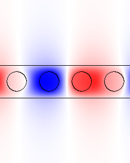|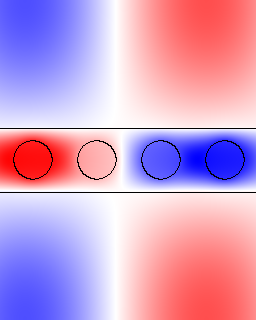|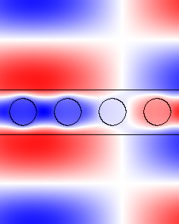
|run-te|||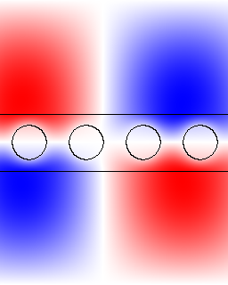

### Fixed Point Filter

This is the last solutions recommended when automatic work cannot get the correct result. By fixing some certain points will help solve this problem.

## Platform
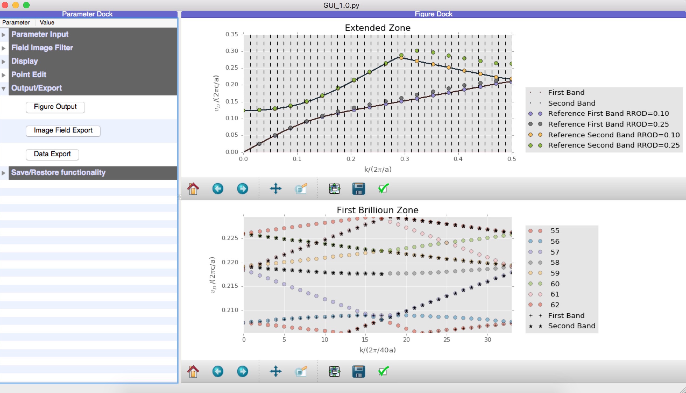

###Check Before Runing the GUI
####Check your csv file in right form


####Check your Image field images and make sure they are in one directory.

###Parameter Tree Dock
Parameter Group | Description | Screenshot
--- | --- | ---
Parameter Input | 		**NHole**: Number of the hole. 					<br />	**Period**: The period of brillioun zone.  			<br />	**BandNum**:Total Bandnum in the raw data.  			<br />	**CSV File Path**: The path of data file. 				<br />	**First Band Start Point**: Define the starting point of First Band(Any delimiter is acceptible). 					<br />	**Second Band Start Point**:Define the starting point of Second Band.								<br />**Reference Group**: Use to add some reference point and it will automatically adjusted to fill the extended zone defined by NHole and Period above.|  
Field Image Filter |    **Field Image**: The path of field images directory.	 <br />**Sort**: Sort the image by band number.				<br />**Unsort**:Unsort the image(Used for some special cases).<br />**Repair**:Check the completeness of field image and complete using a specific image(k18.b01) to avoid some bugs when running field image filter.						<br />**Image Processor 1/2**:Automatically filter out Second/Third Band field images from First/Second Band field images using openCV packge(It is recommended to rewrite such processor or do it by hand if you don't get what you want).										<br />**Image Filter 1/2**:Switch for field image filter 1/2.| 
| Display| Switch some Display(Sometimes these can also be done in Navigation Bar)<br />**Overlap Start/End Band**: The band ranges in First Brillioun Zone.|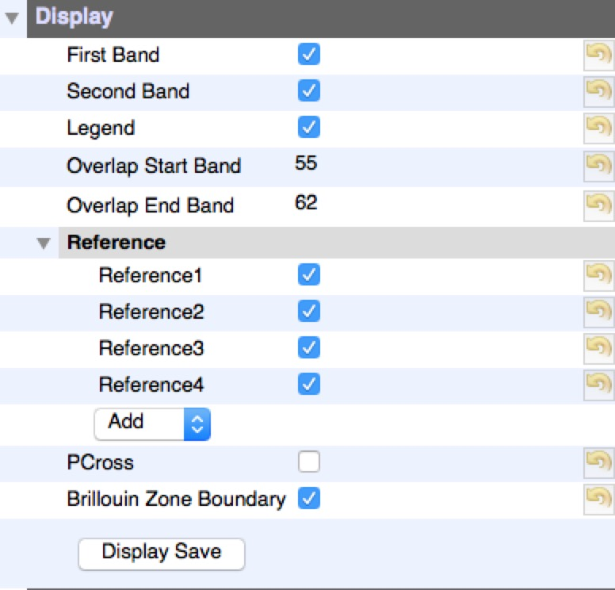
|Point Edit| Textboxes for input fixed points |
|Output/Export|**Figure Output**: Redraw the figure.		<br \>**Image Field Export**: Export the field image in the seqeuence of k|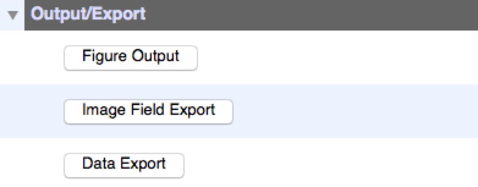
##Example
### Band Diagram of Photonic Crystal Nanobeam Cavity
#### Test and Verity using Photonic Crystal with Uniform Radius
To test and verift the validity of such tool, 40 holes of uniform radius is simulated by MPB and checked by the reference structure of one hole structure. As the every hole repeat itself strictly, the band diagram of forty-hole structure should be strictly the same as one-hole struture.
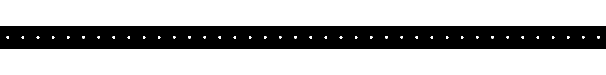

Set the parameter tree


Parameter | Value 
--- | --- 
|NHole|40
|Period|34
|BandNum|100
|CSV File Path |./Hole40-r0.1.csv|
|Reference1 Name |Reference First Band RROD=0.10
|Reference1 Data|[0.0, 0.0251504, 0.0494593, 0.0717521, 0.0905083, 0.10496, 0.116102, 0.125494, 0.134148, 0.14256, 0.150954, 0.159428, 0.168017, 0.176729, 0.185545, 0.194412, 0.203102, 0.208988]|
|Reference2 Name|Reference Second Band RROD=0.10
|Reference2 Data|[0.123531, 0.124829, 0.128955, 0.136677, 0.149202, 0.167024, 0.18889, 0.212974,0.237945, 0.262836, 0.280369, 0.27083, 0.261153, 0.251537, 0.242014, 0.232643, 0.223651, 0.217664]
|Field Image Filter.Image Filter 1|False|
|Field Image Filter.Image Filter 2|False|
|Display.Reference1|True|
|Display.Reference2|True|
|Display.Reference3|False|
|Display.Reference4|False|

Click `Figure Output` 

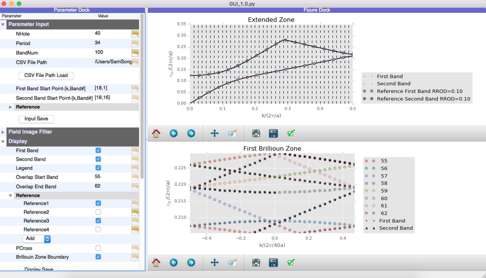

Check the Bandedge and it is found to be correct.

 |40 Holes | 1 Hole 
--- | --- | --- 
|First Band Bandedge| 0.208988| 0.208988
|Second Band Bandedge| 0.217663| 0.217664

#### Adding Quadratic Tapering Structure

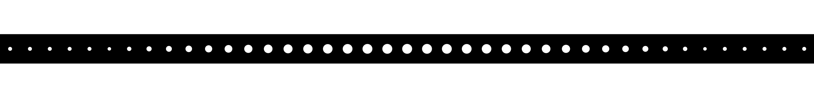

Parameter | Value 
--- | --- 
|NHole|41
|Period|34
|BandNum|150
|CSV File Path |./mirrortaperholecavity\_r0.25\_r0.1.csv|
|Reference1 Name |Reference First Band RROD=0.10
|Reference1 Data|[0.0, 0.0251504, 0.0494593, 0.0717521, 0.0905083, 0.10496, 0.116102, 0.125494, 0.134148, 0.14256, 0.150954, 0.159428, 0.168017, 0.176729, 0.185545, 0.194412, 0.203102, 0.208988]|
|Reference1 Name |Reference First Band RROD=0.25
|Reference1 Data|[0, 0.0252969, 0.0498416, 0.0726113, 0.092289, 0.108107, 0.120791, 0.131716, 0.141846,0.151657, 0.161344, 0.170954, 0.180446, 0.189696, 0.198452, 0.206208, 0.211974, 0.214207]|
|Reference3 Name|Reference Second Band RROD=0.10
|Reference3 Data|[0.123531, 0.124829, 0.128955, 0.136677, 0.149202, 0.167024, 0.18889, 0.212974,0.237945, 0.262836, 0.280369, 0.27083, 0.261153, 0.251537, 0.242014, 0.232643, 0.223651, 0.217664]
|Reference4 Name|Reference Second Band RROD=0.25
|Reference4 Data|[0.124544, 0.125952, 0.130361, 0.138381, 0.150985, 0.168626, 0.190284, 0.214288,0.239337, 0.264467, 0.288292, 0.301733, 0.295688, 0.286956, 0.278316, 0.270572, 0.264797, 0.262559]
|Display.Reference1|True|
|Display.Reference2|True|
|Display.Reference3|True|
|Display.Reference4|True|

Click `Figure Output` , you would find the figure is not the right as it is far away from the reference.
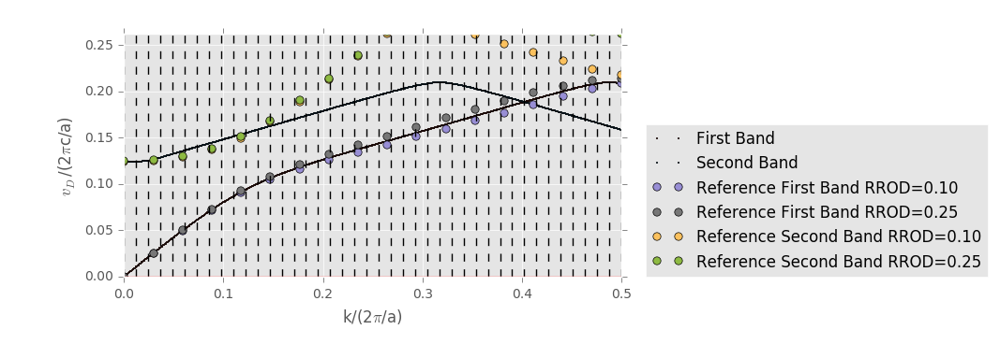

Now try field image filter first.
To apply the Field Image Filter, you need to set the parameters first.

Parameter | Value 
--- | --- 
|Field Image|./PNGlogfile

Click `Sort` , then you get sorted Field Image by band order.

Click `Repair`, then you find some missed figures are completed by a specific image field(mostly it is totally black). If you click it again, the program will tell you that is an invalid process(such design is to avoid click repair after running `Field Image Processor`.)

As the First Band is almost right, you could skip `Field Image Processor 1`. 

Click `Field Image Processor 2`. Get a cup of coffee and wait patiently after it finishes.

Set parameter below

Parameter | Value 
--- | --- 
|Field Image Filter.Image Filter 1|True|
|Field Image Filter.Image Filter 2|True|

Then click `Figure Output`

You will find there is nothing changed. The second band is still plotted incorrect. Now it is time to try to fix some points. Set the parameter below

Parameter | Value 
--- | --- 
|Display.Overlap Start Band|16|
|Display.Overlap End Band|20|

Click `Figure Output`

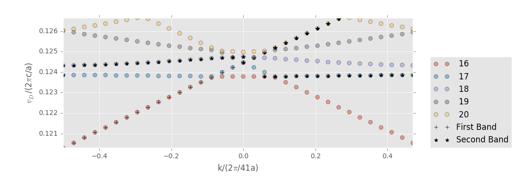

As you can see that the Second Band is interfered by the First Band, reading the field image of such area you can confirm this. To deal with this problem, the easy choice is to fix the point of second band(or you could try in either way: 1.filter out some field image in Band folder 2.rewrite the field image processor).
To do this, 


Click `Figure Output`, then you find that part of second band is correct now(to make sure you can output the field image and check).

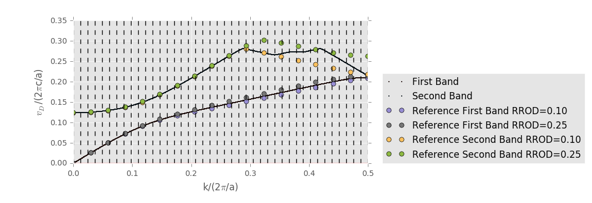

Repeat such process. You will get such fixed point dataset.
 
Parameter | Value 
--- | --- 
|Fixed Point-First Band| [680,58],[681,58]|
|Fixed Point-First Band|[37,19],[401,87],[402,87],[408,91],[409,92],[415,93],[416,93],[442,89],[443,89],[469,85],[470,85],[544,71],[545,71],[561,71],[562,71],[578,69],[579,69],[595,67],[596,67],[612,67],[613,67],[629,65],[630,65],[646,63],[647,63],[663,61],[664,61],[680,59],[681,59]|

You can try to switch off the image filter if it is useless in the end.

Parameter | Value 
--- | --- 
|Field Image Filter.Image Filter 1|False|
|Field Image Filter.Image Filter 2|False|

Click `Figure Output` 

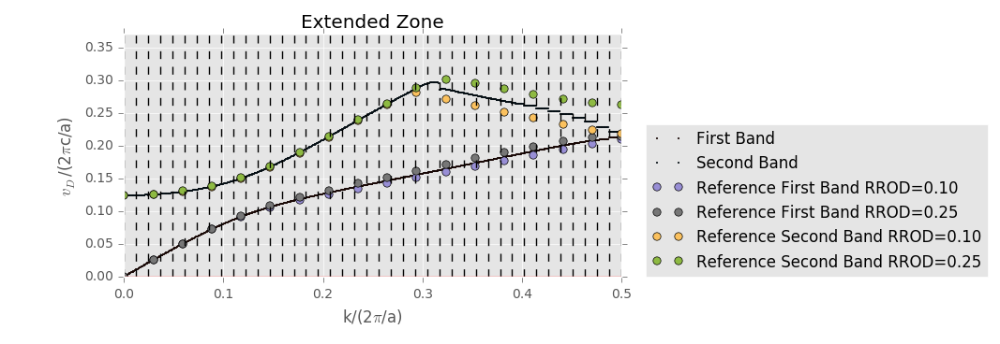

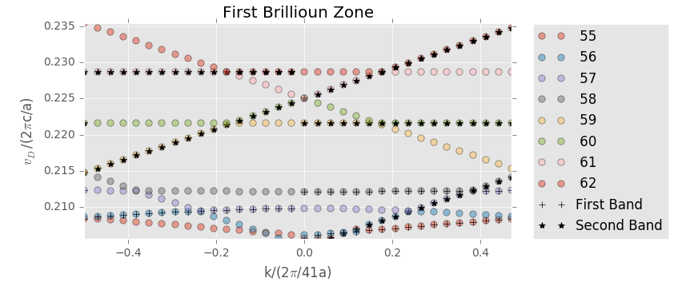
# BandExtendTool
